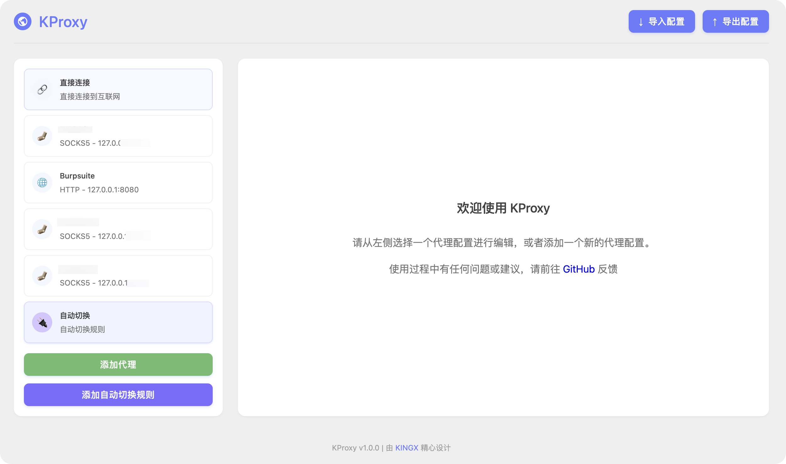

# KProxy: Chrome Proxy Manager

*   Effortlessly manage and switch between HTTP, HTTPS, and SOCKS5 proxies.
*   Automatically switch proxies based on website (URL/hostname matching).
*   Import AutoProxy rule lists.

# Screenshot

